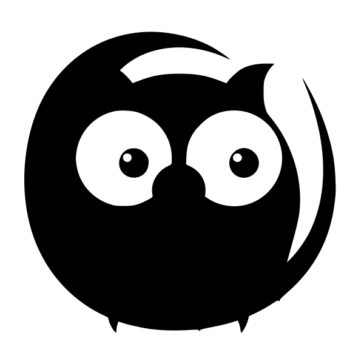

### Codebase for Master's Thesis: [Visualizing the effects of domain shift on CNN-based image segmentation](https://github.com/Olbert/Thesis)

In this work, we are trying to apply dimensionality reduction techniques to make better visualizations of inner representations of pretrained U-Net models. The final goal of this work is to create a tool that can help to explore the domain shift problem in a given U-Net model.

<!-- ### Codebase for Bachelor's Thesis: [Dynamics simulation](https://github.com/wi1k1n/simulation-dynamic-systems)

Repo with my final project of Bachelor's Degree. It contains C# and C++ solutions for calculating, analyzing and visualizing scale-free networks with dynamics on them. The Kuramoto oscillators are used as dynamic model in network nodes.
 -->

### [Vision Systems Lab](https://github.com/Olbert/Vision-Systems-Lab)

Repository of the CudaVision Lab at University of Bonn (SS19) implemented (mostly) on PyTorch, Python3 and Jupyter notebooks. The project begins from the basics of neural networks and continues to deeper models.

### [Unsupervised Anomaly Segmentation in Brain MR Images using Context Variational Autoencoder](https://github.com/Olbert/VDA_Pytorch)

This article proposes an unsupervised algorithm that can outline a brain tumor by reconstructing model-internal representation of the brain without a tumor and comparing it to the actual MRI scan. The main part of the algorithm is a deep learning-based variational autoencoder. It is trained with augmented healthy brain MRI scans from BraTS 2019 dataset for which, the autoencoder learns to reconstruct the healthy images. Given unhealthy brain MRI scan, i.e. image containing tumor, autoencoder returns a healthy version of it. By calculating residual between two images and applying Gaussian Mixture Model we are able to outline the tumor on a scan.

### [Postgres2Prolog](https://github.com/Olbert/Postgres2Prolog)

This project provides tools to convert PostgreSQL databases to Prolog files and back. 
Part of the article "Specialized Case Tools for the Development of Expert Systems".

[Paper](https://link.springer.com/chapter/10.1007/978-3-319-77703-0_59)

### [ReshuEGE Parser](https://github.com/Olbert/ResuEgeParser)

Parser for [resuege.ru](www.reshuege.ru) website.
Created as a part of a lab project at Kazan Federal Univercity for ease the process of test completion on the web site. 
The program parses entire database of questions form the website and provides interface for questions filtering and selection.
Questions and answers then compiled into csv format for further processing.

### [Humanoid Robotics Repository](https://github.com/Olbert/Humanoid-Robotics-Course)

Repository of the Humanoid Robotics lecture at University of Bonn (SS19) implemented on C++. The project begins from the basics of linear lgebra and continues to path planning algorithms and Inverse Kinematics.
